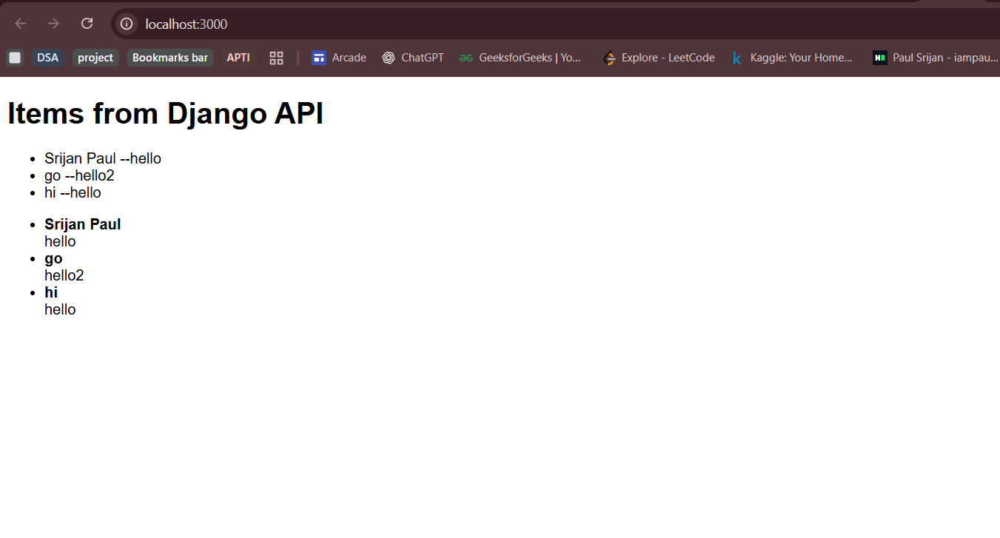

# django-Nextjs-app
A scalable and performant full-stack application boilerplate. It utilizes the power of Django (Python) and Django REST Framework for a robust, secure API backend, combined with Next.js (React) for a fast, modern, and SEO-friendly frontend experience.


## ⚙️ STEPS TO CONNECT NEXT.JS WITH DJANGO

### **1️⃣ Build your Django API**

* Use **Django REST Framework** to expose endpoints (e.g., `/api/items/`)
* Run Django on `http://127.0.0.1:8000/`

---

### **2️⃣ Enable CORS in Django**

Install and configure CORS:

```bash
pip install django-cors-headers
```

In `settings.py`:

```python
INSTALLED_APPS = [
    'corsheaders',
    ...
]

MIDDLEWARE = [
    'corsheaders.middleware.CorsMiddleware',
    ...
]

CORS_ALLOWED_ORIGINS = [
    "http://localhost:3000",  # your Next.js app
]
```

---

### **3️⃣ Setup Next.js Frontend**

Run:

```bash
npx create-next-app@latest frontend
```

Make sure you use the **App Router structure (`app/` folder)**.

---

### **4️⃣ Fetch Data from Django**

In `src/app/page.js`:

**(Server-side fetch — recommended)**

```js
export default async function HomePage() {
  const res = await fetch("http://127.0.0.1:8000/api/items/", {
    next: { revalidate: 10 },
  });
  const items = await res.json();

  return (
    <main>
      <h1>Items from Django</h1>
      <ul>
        {items.map((i) => <li key={i.id}>{i.name}</li>)}
      </ul>
    </main>
  );
}
```

---

### **5️⃣ Run Both Servers**

```bash
# Django backend
python manage.py runserver

# Next.js frontend
npm run dev
```

Access:
👉 [http://localhost:3000](http://localhost:3000) — shows Django data.

---

## 🧾 QUICK SUMMARY TABLE

| Step | Action                     | Purpose                            |
| ---- | -------------------------- | ---------------------------------- |
| 1    | Create Django API          | Provide data endpoints             |
| 2    | Enable CORS                | Allow Next.js to fetch from Django |
| 3    | Create Next.js App         | Frontend UI                        |
| 4    | Fetch API in `app/page.js` | Display Django data                |
| 5    | Run both servers           | Integrate frontend + backend       |

---

✅ **In short:**

> Django = Backend (API provider)
> Next.js = Frontend (API consumer)
> Connection = via `fetch()` with CORS enabled

---

Would you like me to add the **POST request integration** next — i.e., how to send data from Next.js form → Django API (for creating items)?

